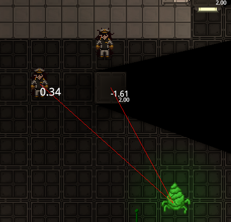
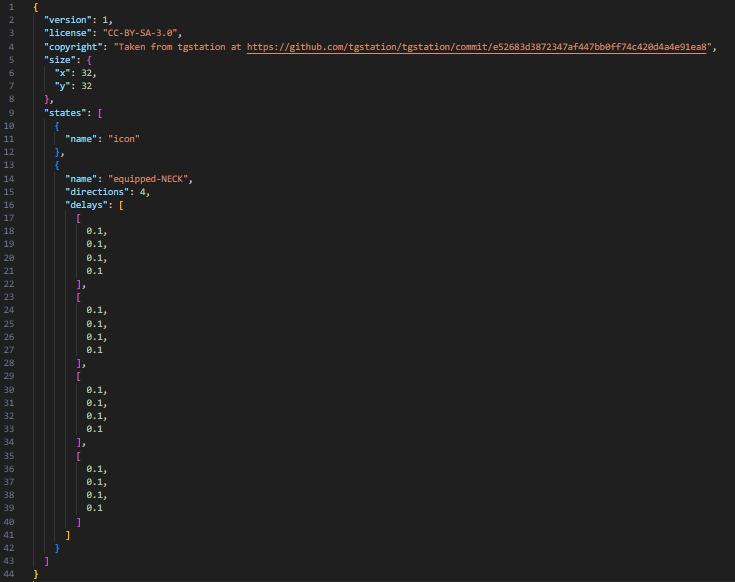

---
---
<head>
    <link rel="stylesheet" href="hover.css">
</head>

<style>
  code {
    background-color: #1e1c1a; /* Darker background */
    color: #e0e0e0; /* Lighter text */
    border-radius: 3px;
    padding: 3px 5px;
    font-family: 'SFMono-Regular', Consolas, 'Liberation Mono', Menlo, monospace;
  }
</style>

<div style="background-color: #252929; color: #3588b1; padding: 10px; border-left: 4px solid #3588b1;">
  This document aims to bring both common and obscure commands to light for ease of use for admins and devs alike. <strong>Some of the examples used use arbitrary entity IDs as well as usernames for clarity.</strong> You should change these to fit your needs.
</div><br>
<style>
  .timestamp {
    font-size: 12px;
    color: #6c757d;
    font-style: italic;
    text-align: right;
    display: block;
    margin-top: -10;
  }
</style>
<div class="timestamp">Last updated: March 14th, 2025<br>
Current tasks:<br>
FIX THE SHITTY HTML/markddown OHHH MY GODH<br>
Add images to commands that would benefit it<br>
Write a proper guide to prototypes<br>
Add more toolshed documentation
</div>

## Table of Contents
* TOC
{:toc}

# Classic/VV commands
## Simple commands
### Helpful (Basics)
<table style="width: 100%; border-collapse: collapse; margin: 20px 0; font-family: -apple-system, BlinkMacSystemFont, 'Segoe UI', Helvetica, Arial, sans-serif; box-shadow: 0 2px 3px rgba(0,0,0,0.1);">
  <thead>
    <tr>
      <th style="padding: 12px 15px; text-align: left; background-color: #1e1c1a; color: white; border-top-left-radius: 6px;">Command</th>
      <th style="padding: 12px 15px; text-align: left; background-color: #1e1c1a; color: white;">Description</th>
      <th style="padding: 12px 15px; text-align: left; background-color: #1e1c1a; color: white; border-top-right-radius: 6px;">Syntax</th>
    </tr>
  </thead>
  <tbody>
    <tr style="background-color: #233134;">
      <td style="padding: 12px 15px; border-bottom: 1px solid #212121;"><strong>help, oldhelp</strong></td>
      <td style="padding: 12px 15px; border-bottom: 1px solid #212121;">Returns a description of the following command and its usage.</td>
      <td style="padding: 12px 15px; border-bottom: 1px solid #212121;">
        <code>help &lt;command&gt;</code>
      </td>
    </tr>
    <tr style="background-color: #2b2721;">
      <td style="padding: 12px 15px; border-bottom: 1px solid #212121;"><strong>list</strong></td>
      <td style="padding: 12px 15px; border-bottom: 1px solid #212121;">Returns a list of all commands. Paired with a keyword, returns a list of commands containing that word.</td>
      <td style="padding: 12px 15px; border-bottom: 1px solid #212121;">
        <code>list &lt;keyword&gt;</code>
      </td>
    </tr>
    <tr style="background-color: #233134;">
      <td style="padding: 12px 15px; border-bottom: 1px solid #212121;"><strong>adminwho</strong></td>
      <td style="padding: 12px 15px; border-bottom: 1px solid #212121;">Returns a list of online admins, excluding deadminned admins.</td>
      <td style="padding: 12px 15px; border-bottom: 1px solid #212121;">
        <code>adminwho</code>
      </td>
    </tr>
    <tr style="background-color: #2b2721;">
      <td style="padding: 12px 15px; border-bottom: 1px solid #212121;"><strong>aghost</strong></td>
      <td style="padding: 12px 15px; border-bottom: 1px solid #212121;">Turn yourself into an admin ghost, or back again.</td>
      <td style="padding: 12px 15px; border-bottom: 1px solid #212121;">
        <code>aghost</code>
      </td>
    </tr>
    <tr style="background-color: #233134;">
      <td style="padding: 12px 15px; border-bottom: 1px solid #212121;"><strong>deadmin</strong></td>
      <td style="padding: 12px 15px; border-bottom: 1px solid #212121;">Removes all admin functions from the user.</td>
      <td style="padding: 12px 15px; border-bottom: 1px solid #212121;">
        <code>deadmin</code>
      </td>
    </tr>
    <tr style="background-color: #2b2721;">
      <td style="padding: 12px 15px; border-bottom: 1px solid #212121;"><strong>readmin</strong></td>
      <td style="padding: 12px 15px; border-bottom: 1px solid #212121;">Returns all admin functions to the user after they deadmin. Not necessary to run upon joining.</td>
      <td style="padding: 12px 15px; border-bottom: 1px solid #212121;">
        <code>readmin</code>
      </td>
    </tr>
    <tr style="background-color: #233134;">
      <td style="padding: 12px 15px; border-bottom: 1px solid #212121;"><strong>quit</strong></td>
      <td style="padding: 12px 15px; border-bottom: 1px solid #212121;">Closes the Game.</td>
      <td style="padding: 12px 15px; border-bottom: 1px solid #212121;">
        <code>quit</code>
      </td>
    </tr>
    <tr style="background-color: #2b2721;">
      <td style="padding: 12px 15px; border-bottom: 1px solid #212121;"><strong>tpto</strong></td>
      <td style="padding: 12px 15px; border-bottom: 1px solid #212121;">Teleport all targets to the first ID/user in the command.</td>
      <td style="padding: 12px 15px; border-bottom: 1px solid #212121;">
        <code>tpto Skarlet Chief_Engineer liltenhead 1234567</code><br><br>This will teleport CE, Lilten and entity with ID 1234567 to Skarlet.
      </td>
    </tr>
    <tr style="background-color: #233134;">
      <td style="padding: 12px 15px; border-bottom: 1px solid #212121;"><strong>tp</strong></td>
      <td style="padding: 12px 15px; border-bottom: 1px solid #212121;">Teleports yourself to the coordinates on the specified map. Syntax goes X, Y, mapID.</td>
      <td style="padding: 12px 15px; border-bottom: 1px solid #212121;">
        <code>tp 14 -186 61</code>
      </td>
    </tr>
    <tr style="background-color: #2b2721;">
      <td style="padding: 12px 15px; border-bottom: 1px solid #212121;"><strong>customvote</strong></td>
      <td style="padding: 12px 15px; border-bottom: 1px solid #212121;">Creates a custom vote for all players, requires at least two choices. Always do this before running any important events.</td>
      <td style="padding: 12px 15px; border-bottom: 1px solid #212121;">
        <code>customvote "Do fish fly?" Yes No "Sometimes, I dream about cheese" Maybe</code>
      </td>
    </tr>
    <tr style="background-color: #233134;">
      <td style="padding: 12px 15px; border-bottom: 1px solid #212121;"><strong>delayroundstart</strong></td>
      <td style="padding: 12px 15px; border-bottom: 1px solid #212121;">Delay round start in seconds. Leave blank to pause, use again to unpause.</td>
      <td style="padding: 12px 15px; border-bottom: 1px solid #212121;">
        <code>delayroundstart 30</code>
      </td>
    </tr>
    <tr style="background-color: #2b2721;">
      <td style="padding: 12px 15px; border-bottom: 1px solid #212121;"><strong>votemenu</strong></td>
      <td style="padding: 12px 15px; border-bottom: 1px solid #212121;">Opens the 'Call Vote' menu.</td>
      <td style="padding: 12px 15px; border-bottom: 1px solid #212121;">
        <code>votemenu</code>
      </td>
    </tr>
    <tr style="background-color: #233134;">
      <td style="padding: 12px 15px; border-bottom: 1px solid #212121;"><strong>cancelvote</strong></td>
      <td style="padding: 12px 15px; border-bottom: 1px solid #212121;">Cancels an ongoing vote. Autocompletes.</td>
      <td style="padding: 12px 15px; border-bottom: 1px solid #212121;">
        <code>cancelvote 3</code>
      </td>
    <tr style="background-color: #2b2721;">
      <td style="padding: 12px 15px; border-bottom: 1px solid #212121;"><strong>warp</strong></td>
      <td style="padding: 12px 15px; border-bottom: 1px solid #212121;">Teleports you to a warp point.</td>
      <td style="padding: 12px 15px; border-bottom: 1px solid #212121;">
        <code>warp evac</code>
      </td>
    </tr>
    </tr>
  </tbody>
</table>


### Helpful (Adminning)

<table style="width: 100%; border-collapse: collapse; margin: 20px 0; font-family: -apple-system, BlinkMacSystemFont, 'Segoe UI', Helvetica, Arial, sans-serif; box-shadow: 0 2px 3px rgba(0,0,0,0.1);">
  <thead>
    <tr>
      <th style="padding: 12px 15px; text-align: left; background-color: #1e1c1a; color: white; border-top-left-radius: 6px;">Command</th>
      <th style="padding: 12px 15px; text-align: left; background-color: #1e1c1a; color: white;">Description</th>
      <th style="padding: 12px 15px; text-align: left; background-color: #1e1c1a; color: white; border-top-right-radius: 6px;">Syntax</th>
    </tr>
  </thead>
  <tbody>
    <tr style="background-color: #233134;">
      <td style="padding: 12px 15px; border-bottom: 1px solid #212121;"><strong>lsobjectives</strong></td>
      <td style="padding: 12px 15px; border-bottom: 1px solid #212121;">Shows all objectives of the targeted user.</td>
      <td style="padding: 12px 15px; border-bottom: 1px solid #212121;">
        <code>lsobjectives Skarlet</code>
      </td>
    </tr>
    <tr style="background-color: #2b2721;">
      <td style="padding: 12px 15px; border-bottom: 1px solid #212121;"><strong>crewmanifest</strong></td>
      <td style="padding: 12px 15px; border-bottom: 1px solid #212121;">Opens the station's manifest without using a PDA. Autocompletes the station's ID.</td>
      <td style="padding: 12px 15px; border-bottom: 1px solid #212121;">
        <code>crewmanifest 1234567</code>
      </td>
    </tr>
    <tr style="background-color: #233134;">
      <td style="padding: 12px 15px; border-bottom: 1px solid #212121;"><strong>rename</strong></td>
      <td style="padding: 12px 15px; border-bottom: 1px solid #212121;">Renames the entity and also its PDA. More powerful than the rename trick.</td>
      <td style="padding: 12px 15px; border-bottom: 1px solid #212121;">
        <code>rename 1234567 "John Centcomm"</code>
      </td>
    </tr>
    <tr style="background-color: #2b2721;">
      <td style="padding: 12px 15px; border-bottom: 1px solid #212121;"><strong>delayroundend</strong></td>
      <td style="padding: 12px 15px; border-bottom: 1px solid #212121;">Delays the round end summary in seconds. Use while the evacuation shuttle is in transit to centcom.</td>
      <td style="padding: 12px 15px; border-bottom: 1px solid #212121;">
        <code>delayroundend 90</code>
      </td>
    </tr>
    <tr style="background-color: #233134;">
      <td style="padding: 12px 15px; border-bottom: 1px solid #212121;"><strong>griddrag</strong></td>
      <td style="padding: 12px 15px; border-bottom: 1px solid #212121;">Used like a force gun, moves grids around quickly. Use at your own risk, it is a toggle.</td>
      <td style="padding: 12px 15px; border-bottom: 1px solid #212121;">
        <code>griddrag</code>
      </td>
    </tr>
    <tr style="background-color: #2b2721;">
      <td style="padding: 12px 15px; border-bottom: 1px solid #212121;"><strong>kicknonwhitelist</strong></td>
      <td style="padding: 12px 15px; border-bottom: 1px solid #212121;">Kicks non-whitelisted players from the server.</td>
      <td style="padding: 12px 15px; border-bottom: 1px solid #212121;">
        <code>kicknonwhitelist</code>
      </td>
    </tr>
    <tr style="background-color: #233134;">
      <td style="padding: 12px 15px; border-bottom: 1px solid #212121;"><strong>ban_exemption_update</strong></td>
      <td style="padding: 12px 15px; border-bottom: 1px solid #212121;">Used for adding ban exemptions, e.g., to exclude a player from an IP ban on shared connections. These exemptions require votes.</td>
      <td style="padding: 12px 15px; border-bottom: 1px solid #212121;">
        <code>ban_exemption_update Repo 127.0.0.1</code>
      </td>
    </tr>
    <tr style="background-color: #2b2721;">
      <td style="padding: 12px 15px; border-bottom: 1px solid #212121;"><strong>menuvis</strong></td>
      <td style="padding: 12px 15px; border-bottom: 1px solid #212121;">Used to see every entity you can find when right-clicking a tile.</td>
      <td style="padding: 12px 15px; border-bottom: 1px solid #212121;">
        <code>menuvis all</code> to use <code>menuvis</code> to remove
      </td>
    </tr>
  </tbody>
</table>

<!-- -->

### Debug

<table style="width: 100%; border-collapse: collapse; margin: 20px 0; font-family: -apple-system, BlinkMacSystemFont, 'Segoe UI', Helvetica, Arial, sans-serif; box-shadow: 0 2px 3px rgba(0,0,0,0.1);">
  <thead>
    <tr>
      <th style="padding: 12px 15px; text-align: left; background-color: #1e1c1a; color: white; border-top-left-radius: 6px;">Command</th>
      <th style="padding: 12px 15px; text-align: left; background-color: #1e1c1a; color: white;">Description</th>
      <th style="padding: 12px 15px; text-align: left; background-color: #1e1c1a; color: white; border-top-right-radius: 6px;">Syntax</th>
    </tr>
  </thead>
  <tbody>
    <tr style="background-color: #233134;">
      <td style="padding: 12px 15px; border-bottom: 1px solid #212121;"><strong>vv</strong></td>
      <td style="padding: 12px 15px; border-bottom: 1px solid #212121;">Opens graphical VV editor for given entity. Can help with accessing something you can't right-click, including server-only entities.</td>
      <td style="padding: 12px 15px; border-bottom: 1px solid #212121;">
        <code>vv 12345678</code>
      </td>
    </tr>
    <tr style="background-color: #2b2721;">
      <td style="padding: 12px 15px; border-bottom: 1px solid #212121;"><strong>vvwrite</strong></td>
      <td style="padding: 12px 15px; border-bottom: 1px solid #212121;">Used to change a component's values.</td>
      <td style="padding: 12px 15px; border-bottom: 1px solid #212121;">
        <code>vvwrite 12345678 ComponentName Value</code>
      </td>
    </tr>
    <tr style="background-color: #233134;">
      <td style="padding: 12px 15px; border-bottom: 1px solid #212121;"><strong>vvread</strong></td>
      <td style="padding: 12px 15px; border-bottom: 1px solid #212121;">Used to read a component's values. Used like vvwrite.</td>
      <td style="padding: 12px 15px; border-bottom: 1px solid #212121;">
        <code>vvread 12345678 ComponentName</code>
      </td>
    </tr>
    <tr style="background-color: #2b2721;">
      <td style="padding: 12px 15px; border-bottom: 1px solid #212121;"><strong>addcomp</strong></td>
      <td style="padding: 12px 15px; border-bottom: 1px solid #212121;">Adds a component to an entity.</td>
      <td style="padding: 12px 15px; border-bottom: 1px solid #212121;">
        <code>addcomp 1234567 Jittering</code>
      </td>
    </tr>
    <tr style="background-color: #233134;">
      <td style="padding: 12px 15px; border-bottom: 1px solid #212121;"><strong>fixgridatmos</strong></td>
      <td style="padding: 12px 15px; border-bottom: 1px solid #212121;">Resets the grid's atmos. This WILL reset pipe contents as well.<br><br>Be careful about running this on the main station, as this may also reset anything crew (e.g. atmos techs) did intentionally, like frezon production setups.</td>
      <td style="padding: 12px 15px; border-bottom: 1px solid #212121;">
        <code>fixgridatmos 1234567</code>
      </td>
    </tr>
    <tr style="background-color: #2b2721;">
  <td style="padding: 12px 15px; border-bottom: 1px solid #212121;">
    <span class="hover-container">
      <strong>showradiation</strong>
      
    </span>
  </td>
  <td style="padding: 12px 15px; border-bottom: 1px solid #212121;">
    Displays a radiation source's range, the entities it hits, and the radiation protection of entities.
  </td>
  <td style="padding: 12px 15px; border-bottom: 1px solid #212121;">
    <code>showradiation</code>
  </td>
</tr>
    <tr style="background-color: #233134;">
      <td style="padding: 12px 15px; border-bottom: 1px solid #212121;"><strong>showambient</strong></td>
      <td style="padding: 12px 15px; border-bottom: 1px solid #212121;">Displays a circle over every item that produces <strong>ambient sounds</strong> on screen, and their range. Red for inactive, orange for active out of range, green for active in range.</td>
      <td style="padding: 12px 15px; border-bottom: 1px solid #212121;">
        <code>showambient</code>
      </td>
    </tr>
    <tr style="background-color: #2b2721;">
  <td style="padding: 12px 15px; border-bottom: 1px solid #212121;">
    <span class="hover-container">
      <strong>showaudio</strong>
      
    </span>
  </td>
  <td style="padding: 12px 15px; border-bottom: 1px solid #212121;">
    Displays every item that produces <strong>active sounds</strong> on screen, and a bunch of stats. Does not display anything unless you are in the sound's range. More robust than showambient in the way that this shows all sounds rather than just ambient.
  </td>
  <td style="padding: 12px 15px; border-bottom: 1px solid #212121;">
    <code>showaudio</code>
  </td>
</tr>
  </tbody>
</table>

<!-- -->

### Admin Abuse

<table style="width: 100%; border-collapse: collapse; margin: 20px 0; font-family: -apple-system, BlinkMacSystemFont, 'Segoe UI', Helvetica, Arial, sans-serif; box-shadow: 0 2px 3px rgba(0,0,0,0.1);">
  <thead>
    <tr>
      <th style="padding: 12px 15px; text-align: left; background-color: #1e1c1a; color: white; border-top-left-radius: 6px;">Command</th>
      <th style="padding: 12px 15px; text-align: left; background-color: #1e1c1a; color: white;">Description</th>
      <th style="padding: 12px 15px; text-align: left; background-color: #1e1c1a; color: white; border-top-right-radius: 6px;">Syntax</th>
    </tr>
  </thead>
  <tbody>
    <tr style="background-color: #233134;">
      <td style="padding: 12px 15px; border-bottom: 1px solid #212121;"><strong>setadminooc</strong></td>
      <td style="padding: 12px 15px; border-bottom: 1px solid #212121;">Changes color of your OOC messages. Persists between reconnects and servers, will not apply while <code>deadmin</code></td>
      <td style="padding: 12px 15px; border-bottom: 1px solid #212121;">
        <code>setadminooc #ff7777</code>
      </td>
    </tr>
    <tr style="background-color: #2b2721;">
      <td style="padding: 12px 15px; border-bottom: 1px solid #212121;"><strong>scale</strong></td>
      <td style="padding: 12px 15px; border-bottom: 1px solid #212121;">Lets you change an entity's scale. 1 is the default value.</td>
      <td style="padding: 12px 15px; border-bottom: 1px solid #212121;">
        <code>scale 1234567 0.5</code>
      </td>
    </tr>
    <tr style="background-color: #233134;">
      <td style="padding: 12px 15px; border-bottom: 1px solid #212121;"><strong>playglobalsound</strong></td>
      <td style="padding: 12px 15px; border-bottom: 1px solid #212121;">Plays a sound based on the given path and sets the volume.</td>
      <td style="padding: 12px 15px; border-bottom: 1px solid #212121;">
        <code>playglobalsound /Uploaded/Skarlet/pretzels.ogg 1</code>
      </td>
    </tr>
    <tr style="background-color: #2b2721;">
      <td style="padding: 12px 15px; border-bottom: 1px solid #212121;"><strong>adduplink</strong></td>
      <td style="padding: 12px 15px; border-bottom: 1px solid #212121;">Adds an uplink to a PDA and links it to a user.</td>
      <td style="padding: 12px 15px; border-bottom: 1px solid #212121;">
        <code>adduplink Skarlet</code>
      </td>
    </tr>
    <tr style="background-color: #233134;">
      <td style="padding: 12px 15px; border-bottom: 1px solid #212121;"><strong>addobjective</strong></td>
      <td style="padding: 12px 15px; border-bottom: 1px solid #212121;">Adds an objective to the user. <a href="https://github.com/space-wizards/space-station-14/blob/master/Resources/Prototypes/Objectives/traitor.yml" target="_blank">Traitor objectives</a> can be found here.</td>
      <td style="padding: 12px 15px; border-bottom: 1px solid #212121;">
        <code>addobjective Skarlet CMOHyposprayStealObjective</code>
      </td>
    </tr>
    <tr style="background-color: #2b2721;">
      <td style="padding: 12px 15px; border-bottom: 1px solid #212121;"><strong>rmobjective</strong></td>
      <td style="padding: 12px 15px; border-bottom: 1px solid #212121;">Removes an objective from the user. Objective number is found using <code>addobjective</code>.</td>
      <td style="padding: 12px 15px; border-bottom: 1px solid #212121;">
        <code>rmobjective Skarlet 0</code>
      </td>
    </tr>
    <tr style="background-color: #233134;">
      <td style="padding: 12px 15px; border-bottom: 1px solid #212121;"><strong>setmind</strong></td>
      <td style="padding: 12px 15px; border-bottom: 1px solid #212121;">Puts the user’s soul into the ID (may require the entity to have a mind).</td>
      <td style="padding: 12px 15px; border-bottom: 1px solid #212121;">
        <code>setmind 1234567 Skarlet</code>
      </td>
    </tr>
    <tr style="background-color: #2b2721;">
      <td style="padding: 12px 15px; border-bottom: 1px solid #212121;"><strong>addhand</strong></td>
      <td style="padding: 12px 15px; border-bottom: 1px solid #212121;">Adds a hand to the entity. Requires the "Hands" component in the entity.</td>
      <td style="padding: 12px 15px; border-bottom: 1px solid #212121;">
        <code>addhand 1234567</code>
      </td>
    </tr>
    <tr style="background-color: #233134;">
      <td style="padding: 12px 15px; border-bottom: 1px solid #212121;"><strong>addgamerule</strong></td>
      <td style="padding: 12px 15px; border-bottom: 1px solid #212121;">Adds the chosen game event to the game. Autocompletes.</td>
      <td style="padding: 12px 15px; border-bottom: 1px solid #212121;">
        <code>addgamerule MeteorSwarm</code>
      </td>
    </tr>
    <tr style="background-color: #2b2721;">
      <td style="padding: 12px 15px; border-bottom: 1px solid #212121;"><strong>endgamerule</strong></td>
      <td style="padding: 12px 15px; border-bottom: 1px solid #212121;">Removes the chosen game rule from the game. Autocompletes.</td>
      <td style="padding: 12px 15px; border-bottom: 1px solid #212121;">
        <code>endgamerule 1234567</code>
      </td>
    </tr>
    <tr style="background-color: #233134;">
      <td style="padding: 12px 15px; border-bottom: 1px solid #212121;"><strong>damage</strong></td>
      <td style="padding: 12px 15px; border-bottom: 1px solid #212121;">Deals or heals damage. Positive for deal, negative for heal. Syntax goes "damage Type Amount [ignoreResistances in a true or false] uID". Setting ignoreresistances to false will take into account armor and other resistances when dealing damage.</td>
      <td style="padding: 12px 15px; border-bottom: 1px solid #212121;">
        <code>damage Brute 30 true 2964</code>
      </td>
    </tr>
  </tbody>
</table>

<br>

## Upload tutorial and commands

<table style="width: 100%; border-collapse: collapse; margin: 20px 0; font-family: -apple-system, BlinkMacSystemFont, 'Segoe UI', Helvetica, Arial, sans-serif; box-shadow: 0 2px 3px rgba(0,0,0,0.1);">
  <thead>
    <tr>
      <th style="padding: 12px 15px; text-align: left; background-color: #1e1c1a; color: white; border-top-left-radius: 6px;">Command</th>
      <th style="padding: 12px 15px; text-align: left; background-color: #1e1c1a; color: white;">Description</th>
      <th style="padding: 12px 15px; text-align: left; background-color: #1e1c1a; color: white; border-top-right-radius: 6px;">Syntax</th>
    </tr>
  </thead>
  <tbody>
    <tr style="background-color: #233134;">
      <td style="padding: 12px 15px; border-bottom: 1px solid #212121;"><strong>uploadfile</strong></td>
      <td style="padding: 12px 15px; border-bottom: 1px solid #212121;">Used to upload singular files. Works anywhere on your PC.</td>
      <td style="padding: 12px 15px; border-bottom: 1px solid #212121;">
        <code>uploadfile Skarlet/pretzels.ogg</code>
      </td>
    </tr>
    <tr style="background-color: #2b2721;">
      <td style="padding: 12px 15px; border-bottom: 1px solid #212121;"><strong>uploadfolder</strong></td>
      <td style="padding: 12px 15px; border-bottom: 1px solid #212121;">Used to upload a folder. The folder's name has to be one word or it won't work. [NEED ASSISTANCE]</td>
      <td style="padding: 12px 15px; border-bottom: 1px solid #212121;">
        <code>scale 1234567 0.5</code>
      </td>
    </tr>
    <tr style="background-color: #233134;">
      <td style="padding: 12px 15px; border-bottom: 1px solid #212121;"><strong>loadprototype</strong></td>
      <td style="padding: 12px 15px; border-bottom: 1px solid #212121;">Uploads a YML and runs it. Make sure you have the right material in the YML before uploading.</td>
      <td style="padding: 12px 15px; border-bottom: 1px solid #212121;">
        <code>loadprototype</code>
      </td>
    </tr>
  </tbody>
</table>
<div style="background-color: #2b2020; color: #ba3b3b; padding: 10px; border-left: 4px solid #ba3b3b;">
  Be extremely careful when uploading prototypes. It is *very* easy to kill the server or end a round. If you are unsure whether your prototype works or if it is up to date, test run it in a dev environment or empty server first.
</div><br>
### Uploading a prototype with `uploadfile`
<a href="https://github.com/Skarletto/SS14Commands/tree/main/prototypes/empstarsneck.rsi" target="_blank"><strong>The files used in this example can be found here!</strong></a>

Uploading singular files is very straightforward. Here is an example to show exactly how to use this command to upload a prototype. In this example, I will upload a custom neck item that displays stars on top of the character wearing it. First, we need to prepare our files.

Regular clothing items really only need an equipped sprite, an icon sprite, and a meta.json file. If this is for an event, you don't really need to add in-hands sprites, so I usually don't bother. I suggest keeping all your sprites/meta.json in the same folder just for ease of access, like the actual files in game. The actual location of each file does not matter when using `uploadfile`, you can separate them if you reeeally want.


To have a properly formatted meta.json, you can just copy one from the game files. There's a lot of examples in there, and once you're familiar with how they work, you'll be able to write your own (to be fair using the existing ones is a QoL lol). <span class="hover-container">Here is how the meta.json file looks for this example. If your sprite is animated, you will need delays to tell the game at what speed it needs to play each sprite. You can tweak every individual number to your liking, so feel free to mess around with that.

Once that's all prepped up, we gotta move onto the code for the item. Yml is thankfully not very hard to work with- Every prototype upload can basically be copied off from an existing prototype and frankensteined into whatever you want it to be. The format is also super straight-forward, and I had zero coding knowledge when I started working with them. Just gotta get used to it. Anyways, a prototype is basically just a long list of components added to it that makes it into an item with properties.

For example, here's our stars' prototype:


To make this prototype, I looked at how other similar items were formatted in \Prototypes\Entities\Clothing\Neck. Reason why this looks so empty is because I specified a parent. That means the prototype will inherit every single component from that parent, and anything specified in the child's file will override it's parent's. So by adding a sprite component to the child, we're overriding the parent's sprite. 

You can trace back the origin of most prototypes to a singular parent. Everything is just frankenstein'd together and built atop one another- Which also means it's really easy to make your own prototypes. I also commented out the commands I need to run so I can easily paste them in the command line in-game.

Now, all we need to do is upload all of the files and run the yml. This is also super simple: `uploadfile Skarlet/empstarsneck.rsi/equipped-MASK.png` . This will open a window, where you are able to select which file to upload. So, we upload `equipped-MASK.png`. In turn, this uploads to a new folder we create through the command, `empstarsneck.rsi`, which is inside of MY upload folder. The upload folder is named after your username, so if you ever plan on using these, make sure to edit my name out before uploading, otherwise it'll upload all of these in your upload folder, in a folder named Skarlet.

Once you upload all of your necessary files, you can finally run the yml. `loadprototype` will open a window that lets you select which file you wish to open. This will load the item and make it available to spawn, unless there is an error with the prototype. Most common errors in prototype making are empty spaces in unintended areas and typos. Make sure everything that is referenced in multiple areas and files are properly written.

You will most likely need to alter the names of your prototype if you are testing things as you go, because the upload system is a little silly. Values in a YML can be edited and re-uploaded easily, but assets like images will need either a dev-environment restart or need you to rename them to produce a separate item.

# VV/Components Documentation
```
 stationID, then open StationBankAccountComponent
```
Lets you adjust the station's spesos account.


***Mind-related Components***
:   Some components are placed in the mind, rather than the entity. This allows you to change things such as antag status or custom objectives. Open the MindContainer component on a player's entity. The second string should say "Mind 1234567". Use the VV command with this to access components such as TraitorRole, InitialInfected, or RoleBriefing.

# Toolshed
Toolshed is the newer alternative of BQL and was developed by Moony.

Toolshed commands must start with a `>` to work properly. The official (unfinished) toolshed documentation can be found [here](https://docs.spacestation14.com/en/robust-toolbox/toolshed.html?highlight=toolshed#toolshed), but it is not necessary to read, nor to learn. Most toolshed commands have autocomplete.
## The Basics
<div style="background-color: #2b2020; color: #ba3b3b; padding: 10px; border-left: 4px solid #ba3b3b;">
  Be extremely careful when using `entities` based Toolshed commands. It is *very* easy to kill the server or end a round. If you are unsure what the command will fully do, test run it in a dev environment or empty server.
</div><br>

<table style="width: 100%; border-collapse: collapse; margin: 20px 0; font-family: -apple-system, BlinkMacSystemFont, 'Segoe UI', Helvetica, Arial, sans-serif; box-shadow: 0 2px 3px rgba(0,0,0,0.1);">
  <thead>
    <tr>
      <th style="padding: 12px 15px; text-align: left; background-color: #1e1c1a; color: white; border-top-left-radius: 6px;">Command</th>
      <th style="padding: 12px 15px; text-align: left; background-color: #1e1c1a; color: white;">Description</th>
      <th style="padding: 12px 15px; text-align: left; background-color: #1e1c1a; color: white; border-top-right-radius: 6px;">Syntax</th>
    </tr>
  </thead>
  <tbody>
    <tr style="background-color: #233134;">
      <td style="padding: 12px 15px; border-bottom: 1px solid #212121;"><strong>explain</strong></td>
      <td style="padding: 12px 15px; border-bottom: 1px solid #212121;">pair with a string to show you exactly what they do and how to use them.</td>
      <td style="padding: 12px 15px; border-bottom: 1px solid #212121;"></td>
    </tr>
    <tr style="background-color: #2b2721;">
      <td style="padding: 12px 15px; border-bottom: 1px solid #212121;"><strong>entities</strong></td>
      <td style="padding: 12px 15px; border-bottom: 1px solid #212121;">Returns a list of all entities. Must be used with a filter (`with` or `prototyped`) to be effective.</td>
      <td style="padding: 12px 15px; border-bottom: 1px solid #212121;"></td>
    </tr>
    <tr style="background-color: #233134;">
      <td style="padding: 12px 15px; border-bottom: 1px solid #212121;"><strong>select</strong></td>
      <td style="padding: 12px 15px; border-bottom: 1px solid #212121;">Takes N number of the input list. Accepts %.</td>
      <td style="padding: 12px 15px; border-bottom: 1px solid #212121;"></td>
    </tr>
    <tr style="background-color: #2b2721;">
      <td style="padding: 12px 15px; border-bottom: 1px solid #212121;"><strong>take</strong></td>
      <td style="padding: 12px 15px; border-bottom: 1px solid #212121;">Take N items off the top of the list.</td>
      <td style="padding: 12px 15px; border-bottom: 1px solid #212121;"></td>
    </tr>
    <tr style="background-color: #233134;">
      <td style="padding: 12px 15px; border-bottom: 1px solid #212121;"><strong>pick</strong></td>
      <td style="padding: 12px 15px; border-bottom: 1px solid #212121;">Takes a single random item from the list.</td>
      <td style="padding: 12px 15px; border-bottom: 1px solid #212121;"></td>
    </tr>
    <tr style="background-color: #2b2721;">
      <td style="padding: 12px 15px; border-bottom: 1px solid #212121;"><strong>with</strong></td>
      <td style="padding: 12px 15px; border-bottom: 1px solid #212121;">Lists entities with the specified prototype.</td>
      <td style="padding: 12px 15px; border-bottom: 1px solid #212121;"></td>
    </tr>
    <tr style="background-color: #233134;">
      <td style="padding: 12px 15px; border-bottom: 1px solid #212121;"><strong>join</strong></td>
      <td style="padding: 12px 15px; border-bottom: 1px solid #212121;">Joins a list with another list. (e.g. entities1 join {entities2})</td>
      <td style="padding: 12px 15px; border-bottom: 1px solid #212121;"></td>
    </tr>
    <tr style="background-color: #2b2721;">
      <td style="padding: 12px 15px; border-bottom: 1px solid #212121;"><strong>nearby</strong></td>
      <td style="padding: 12px 15px; border-bottom: 1px solid #212121;">Takes the entity listed before it then gets entities within N tiles. (e.g. `self nearby 3`)</td>
      <td style="padding: 12px 15px; border-bottom: 1px solid #212121;"></td>
    </tr>
    <tr style="background-color: #233134;">
      <td style="padding: 12px 15px; border-bottom: 1px solid #212121;"><strong>prototyped</strong></td>
      <td style="padding: 12px 15px; border-bottom: 1px solid #212121;">Lists entities that are a specific prototype. (e.g. `prototyped PoweredLight`)</td>
      <td style="padding: 12px 15px; border-bottom: 1px solid #212121;"></td>
    </tr>
    <tr style="background-color: #2b2721;">
      <td style="padding: 12px 15px; border-bottom: 1px solid #212121;"><strong>actor:controlled</strong></td>
      <td style="padding: 12px 15px; border-bottom: 1px solid #212121;">Lists entities that are actively being controlled (i.e. active players).</td>
      <td style="padding: 12px 15px; border-bottom: 1px solid #212121;"></td>
    </tr>
    <tr style="background-color: #233134;">
      <td style="padding: 12px 15px; border-bottom: 1px solid #212121;"><strong>self</strong></td>
      <td style="padding: 12px 15px; border-bottom: 1px solid #212121;">Returns the EID of yourself.</td>
      <td style="padding: 12px 15px; border-bottom: 1px solid #212121;"></td>
    </tr>
    <tr style="background-color: #2b2721;">
      <td style="padding: 12px 15px; border-bottom: 1px solid #212121;"><strong>do</strong></td>
      <td style="padding: 12px 15px; border-bottom: 1px solid #212121;">Runs normal commands for each entity in the list provided. Must be used at end of Toolshed string. All commands must be wrapped in quotations and inner quotes must be escaped (e.g `do "thing $ID \"stuff\"`).</td>
      <td style="padding: 12px 15px; border-bottom: 1px solid #212121;"></td>
    </tr>
  </tbody>
</table>

## String examples

Playing with `entities`
:	`entities` lets you affect multiple entities at once with your commands. You can mix and match commands to achieve a lot of useful or fun things. In the example here, we use entities to return a BQL list of all ghosts:

       > entities with Ghost visualize
       OR
       > entities prototyped MobObserver visualize

    These particular strings are useful should you need to find out how many ghosts you have access to for an event.

```
> stations:get
```
Lets you find out what the station's entity ID is.

## Useful Toolshed Commands
Delete all space garbage: `> entities with SpaceGarbage delete`

# Fun

Turn all MobGlockroach into ghost roles with custom text: `> entities prototyped MobGlockroach do "makeghostrole $ID GLOCKROACH \"ARRGGHHH\" \"BANG BANG POW\""`

Make everyone scream: `> entities with Actor do "osay $ID Emote screams!"`

Night shift lighting: `> entities prototyped Poweredlight do "vvwrite /entity/$ID/PointLight/Radius 4.5" do "vvwrite /entity/$ID/PointLight/Energy 0.5" do "vvwrite /entity/$ID/PointLight/Softness 3"`

